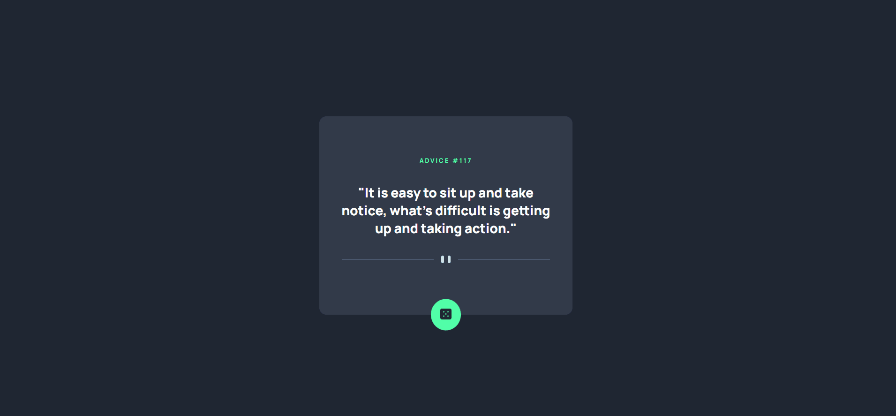
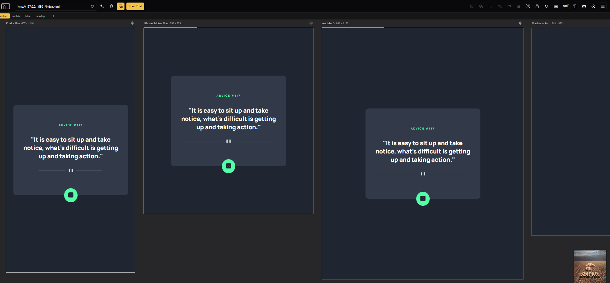

# Projeto Advice Generator App - Desafio Frontend Mentor

## Descrição
Este é um projeto de aplicação web que gera conselhos aleatórios utilizando a [Advice Slip API](https://api.adviceslip.com/) para buscar os conselhos  e seus respectivos IDs. O usuário pode clicar no botão para obter um novo conselho toda vez que desejar. 

Desafio do Frontend Mentor desenvolvido durante o curso DevQuest, onde o objetivo foi praticar o consumo de APIs

## Funcionalidades:
- **Responsivo** -> Layout adaptado em diversos tamanhos de tela.
- **Interatividade** -> Botão gerador de conselho com animação ao passar o cursor.
- **API** -> conselhos aleatórios fornecidos ao clicar no botão.

## Tecnologias Utilizadas:
- **HTML**
- **CSS**
- **JavaScript**

## Demonstração

 
